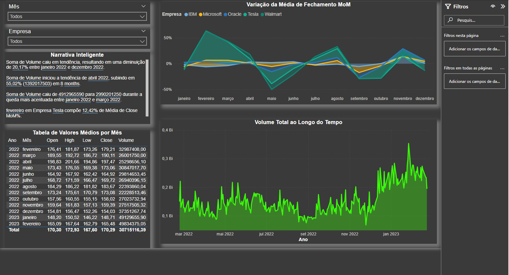

# 📈 Análise de Dados do Mercado de Ações com Power BI

Este projeto apresenta uma análise do mercado financeiro com foco em ações de grandes empresas. O dashboard foi desenvolvido no Power BI com o objetivo de facilitar a visualização da variação mensal de preços, volume de negociações e tendências de comportamento ao longo do tempo.

## 🔍 Principais Análises:

- Variação percentual da média de fechamento mês a mês (MoM)  
- Volume total de ações negociadas ao longo do tempo  
- Narrativas automáticas com insights sobre tendências de volume  
- Comparação entre empresas como Tesla, Microsoft, IBM, Oracle e Walmart  
- Tabela com valores médios mensais (Open, High, Low, Close, Volume)

## 🛠️ Ferramentas Utilizadas

- Power BI Desktop  
- Power Query para tratamento e modelagem dos dados  
- DAX para criação de medidas e comparativos  
- Visuais personalizados com segmentações interativas

## 🎯 Objetivo

Praticar habilidades de visualização e análise de dados no contexto financeiro, promovendo o entendimento sobre comportamento de mercado e tendências de ações de empresas conhecidas.

---

## 📸 Screenshot do Dashboard

### Visão Geral

